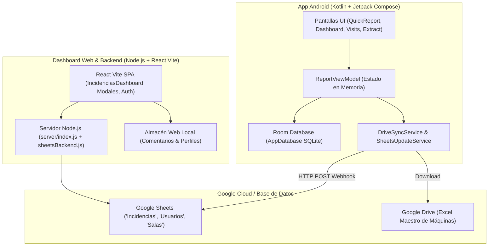
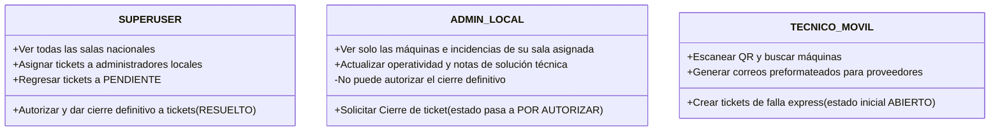

# Diccionario y Guía de Estudio del Ecosistema: Reporte Express
> **Ámbito:** App Android Móvil (`APPNACIONAL`) y Dashboard Web / Backend (`Dashboard-R.E.N.`).  
> **Propósito:** Conocer cada variable, archivo, ruta y función del sistema, así como detectar código residual, ejemplos obsoletos o dependencias innecesarias para optimizar y limpiar el proyecto.

---

## 1. Arquitectura General y Flujo de Datos



---

## 2. Variables de Dominio (Diccionario de Incidencias y Máquinas)

Estas variables representan el **núcleo de datos del negocio** y se comparten conceptualmente entre Android, Google Sheets y el Dashboard Web:

| Variable (Kotlin / JS) | Columna en Sheets | Tipo de Dato | Propósito y Función |
| :--- | :--- | :--- | :--- |
| `idTicket` / `id_ticket` | `A` (`ID_TICKET`) | String | Folio único autogenerado (ej. `PHIE-MX0020389-6`). Identifica la incidencia en todo el sistema. |
| `sala` | `B` (`SALA`) | String | Nombre oficial del casino / sala donde ocurrió la falla (ej. `Winpot Puerta de hierro`). |
| `marca` | `C` (`MARCA`) | String | Fabricante del gabinete / slot machine (ej. `EGT`, `ZITRO`, `IGT`, `AGS`). |
| `modelo` | `D` (`MODELO`) | String | Modelo físico de la máquina (ej. `EGT 50 (PV)`, `A560H`). |
| `serie` | `E` (`SERIE`) | String | Número de serie del fabricante del slot. |
| `asset` / `assetNumber` | `F` (`ASSET`) | String | Número de inventario interno institucional asignado al equipo. |
| `area` | `G` (`AREA`) | String | Sección física de la sala (`FUMAR`, `NO FUMAR`, `SALA PRINCIPAL`). |
| `propietario` | `H` (`PROPIETARIO`) | String | Dueño comercial de la máquina (`WINPOT` o marcas arrendadoras como `EGT`, `ZITRO`). |
| `operativa` | `I` (`OPERATIVA`) | String (`SI`/`NO`) | Indica si la máquina está encendida y jugable (`SI`) o apagada / fuera de servicio (`NO`). |
| `estadoTicket` / `estado_ticket` | `J` (`ESTADO_TICKET`) | String | Estatus del ticket: `ABIERTO`, `PENDIENTE`, `POR AUTORIZAR`, `RESUELTO`. |
| `fechaOrigen` / `fecha_origen` | `K` (`FECHA_ORIGEN`) | String (Fecha/Hora) | Momento exacto en que el técnico levantó el reporte en la app. |
| `fechaReparacion` / `fecha_reparacion` | `L` (`FECHA_REPARACION`) | String (Fecha) | Fecha en que se concluyeron los trabajos técnicos. |
| `falla` | `M` (`FALLA`) | String (Texto largo)| Descripción detallada del problema mecánico, electrónico o de software reportado por el técnico. |
| `prioridad` | `N` (`PRIORIDAD`) | String | Nivel de urgencia operativa: `BAJA`, `MEDIA`, `ALTA`, `CRITICA`. |
| `idTecnico` / `id_tecnico` | `O` (`ID_TECNICO`) | String | Código de nómina o ID del técnico (ej. `WPPHierro-033`). |
| `tecnico` | `P` (`TECNICO`) | String | Nombre completo del técnico que registró el ticket. |
| `asignado` | `Q` (`ASIGNADO`) | String | Usuario Administrador (ADMIN) asignado por el SUPERUSER para dar seguimiento. |
| `resolucion` / `solucion` | `R` (`RESOLUCION`) | String (Texto largo)| Explicación técnica de la solución aplicada para resolver la falla. |

---

## 3. Desglose del Proyecto Android (`APPNACIONAL`)

### A. Estructura de Paquetes y Archivos Clave

```
app/src/main/java/com/example/
├── data/
│   ├── api/
│   │   └── GeminiExtractionService.kt     # Servicio de IA para leer reportes por imagen/OCR
│   ├── db/
│   │   ├── AppDatabase.kt                 # Configuración principal de Room SQLite
│   │   ├── MachineEntity.kt & Dao         # Tabla y queries de máquinas
│   │   ├── TechnicianEntity.kt & Dao      # Tabla y queries de técnicos
│   │   ├── ProviderEmailEntity.kt & Dao   # Tabla de correos de soporte de proveedores
│   │   └── EmailReportEntity.kt & Dao     # Historial de borradores de correos generados
│   ├── demo/
│   │   └── DemoData.kt                    # [REVISIÓN] Datos iniciales / dummy de proveedores y máquinas
│   ├── remote/
│   │   ├── DriveSyncService.kt            # Descarga y sincronización del Excel desde Google Drive
│   │   ├── GoogleSheetsUpdateService.kt   # Envío HTTP POST de nuevos tickets a la API Webhook de Sheets
│   │   ├── IncidenciaItem.kt              # Data class para lectura de tickets
│   │   └── IncidenciaTicketPayload.kt     # Data class para envío JSON de tickets
│   └── repository/
│       └── ReportRepository.kt           # Repositorio unificado (Room + APIs remotas)
├── ui/
│   ├── components/
│   │   ├── VenueLogoBadge.kt              # [REVISIÓN] Insignias e identidad gráfica de salas/marcas
│   │   ├── AnimatedExpandingBottomBar.kt  # Barra de navegación inferior
│   │   └── EmailDraftPreviewDialog.kt     # Vista previa del correo a enviar al proveedor
│   ├── screens/
│   │   ├── QuickReportScreen.kt           # Formulario principal de creación de reportes express
│   │   ├── IncidenciasDashboardScreen.kt  # Visualizador de tickets y KPIs en móvil
│   │   ├── MachineLocationScreen.kt       # Búsqueda rápida de máquinas por serie/asset/sala
│   │   ├── VisitsScreen.kt                # Registro de bitácoras y visitas técnicas
│   │   ├── ExtractFileScreen.kt           # Carga manual de archivos Excel
│   │   └── LoginScreen.kt                 # Inicio de sesión de técnicos
│   └── viewmodel/
│       └── ReportViewModel.kt             # Cerebro de la app Android (manejo de estado en memoria)
└── util/
    ├── FileParserUtil.kt                  # Lector masivo de hojas Excel con Apache POI
    ├── TicketIdGenerator.kt               # Generador de folios únicos de tickets
    └── EmailIntentUtil.kt                 # Constructor del intent para abrir Gmail/Outlook
```

### B. Funciones y Variables Clave en Android

#### 1. `ReportViewModel.kt`
- **Variables de Estado (`StateFlow`):**
  - `_machines`: Lista completa de máquinas cargadas en memoria.
  - `_technicians`: Lista de técnicos autorizados de la sala.
  - `_selectedSala`: Nombre de la sala seleccionada por el usuario.
  - `_isSyncing`: Booleano para spinners de carga mientras sincroniza Google Drive.
  - `_incidenciasTickets`: Lista de incidencias descargadas desde Sheets.
- **Funciones Principales:**
  - `syncFromGoogleDrive(fileId)`: Descarga el archivo `.xlsx` maestro de máquinas y lo almacena en Room.
  - `submitIncidenciaTicket(payload)`: Empaqueta los datos del formulario y llama a `GoogleSheetsUpdateService`.
  - `generateEmailDraft(ticket, provider)`: Construye el asunto y cuerpo del correo con copias (CC) para el proveedor.

#### 2. `FileParserUtil.kt`
- **Función `parseAllData(bytes, defaultSala)`**:
  - Lee dinámicamente las hojas `maquinas`, `tecnicos`, `incidencias` y `proveedores` del archivo Excel usando Apache POI.
  - Normaliza tildes y nombres de salas para evitar discrepancias.

---

## 4. Desglose del Proyecto Dashboard Web (`Dashboard-R.E.N.`)

### A. Estructura de Archivos del Backend y Frontend

```
dashboard-reportes-express/
├── server/
│   ├── index.js              # Servidor HTTP Node.js puro (Endpoints API + Servidor de archivos estáticos)
│   ├── sheetsBackend.js      # Conexión oficial a Google Sheets API v4 con cuenta de servicio
│   └── commentsStore.js      # Almacén de comentarios del minichat y fotos de perfil
└── src/
    ├── views/dashboard/IncidenciasDashboard/
    │   ├── index.jsx         # Vista principal (Filtros, Tabla reactiva, Modal de Detalle, Gestión de Estatus)
    │   ├── KPIHeader.jsx      # Tarjetas superiores de conteo rápido (Abiertos, Críticos, Fuera de Servicio, etc.)
    │   └── TicketChatBox.jsx  # Minichat de notas técnicas en tiempo real dentro del ticket
    ├── components/
    │   ├── ProfilePhotoModal.jsx # Pantalla emergente para subir/quitar foto de perfil
    │   └── ProtectedRoute.jsx    # Guardián de rutas protegidas por token JWT
    ├── layouts/AdminLayout/
    │   ├── Navigation/       # Barra lateral con navegación ('Reportes') y pie de perfil
    │   └── NavBar/NavRight/  # Barra superior con avatar y nombre del usuario
    └── services/
        ├── authService.js         # Manejo de JWT, login, logout y persistencia de credenciales
        ├── incidenciasService.js  # Peticiones al backend para obtener tickets y cambiar estatus
        └── commentsService.js     # Gestión de notas de minichat y foto de perfil
```

### B. Endpoints del Backend (`server/index.js`)

1. **`POST /api/login`**:
   - Valida el usuario y contraseña contra la hoja `Usuarios` en Google Sheets (usando `bcrypt` para contraseñas encriptadas) y entrega un JWT firmado.
2. **`GET /api/incidencias`**:
   - Retorna todas las filas de la pestaña `Incidencias`. Si el usuario es ADMIN de una sala específica (ej. `Winpot Metrocentro`), filtra automáticamente solo sus registros. Si es `SUPERUSER` o `Corporativo GDL`, entrega todas las salas.
3. **`POST /api/incidencias/update-status`**:
   - Actualiza el estatus, máquina operativa, fecha de reparación y notas de solución en la fila exacta de Google Sheets.
4. **`GET /api/admin-users`**:
   - Retorna la lista de usuarios con rol `ADMIN` para que el `SUPERUSER` pueda asignar responsables a los tickets.
5. **`GET /api/comments/:idTicket` & `POST /api/comments/:idTicket`**:
   - Permite consultar y redactar notas técnicas y seguimiento dentro de cada ticket.
6. **`POST /api/user/upload-photo` & `GET /api/user/photo/:usuario`**:
   - Guarda o elimina la foto de perfil en Base64 optimizada.

---

## 5. Hallazgos: Código Obsoleto, Ejemplos Residuales y Oportunidades de Limpieza

Durante la auditoría del código se detectaron los siguientes elementos residuales que pueden ser evaluados para su depuración:

### En la App Android (`APPNACIONAL`):
1. **Marcas y Salas Residuales en `VenueLogoBadge.kt` (Líneas ~75-107)**:
   - Existen estilos y referencias a marcas externas como `CAPRI`, `DIAMONDS`, `VENETO` con lógica de logotipos dedicados (`R.drawable.logo_capri_*`, `R.drawable.logo_diamonds`, etc.).
   - *Recomendación:* Si la aplicación ahora opera exclusivamente bajo la identidad estándar de Winpot / Corporativo, estas bifurcaciones pueden simplificarse a la marca institucional única.
2. **Datos Dummy en `DemoData.kt`**:
   - Contiene listas estáticas de correos de proveedores (`sampleProviderEmails`) con direcciones de prueba que fueron usadas en el prototipo inicial.
   - *Recomendación:* Verificar si Room ya se alimenta 100% de la hoja de Google Sheets / Excel para eliminar la carga de datos estáticos en código duro.

### En el Dashboard Web (`Dashboard-R.E.N.`):
1. **Fuentes e Iconos no utilizados en `src/assets/fonts/`**:
   - Existen paquetes de fuentes como `cryptocoins` (`cryptocoins.ttf`, `cryptocoins.woff2`, `cryptofont.css`) heredados de la plantilla base de React.
   - *Impacto:* Generan peso extra en la descarga inicial (`~250 KB`) sin tener ninguna utilidad en el sistema de incidencias.
2. **Vistas de plantilla no utilizadas en `src/views/`**:
   - La plantilla original incluía vistas de ejemplo (tablas genéricas, gráficos demo, páginas de error no enlazadas).
   - *Recomendación:* Mantener exclusivamente `views/dashboard/IncidenciasDashboard` y `views/auth/login`.

---

## 6. Resumen de Seguridad y Permisos por Rol


